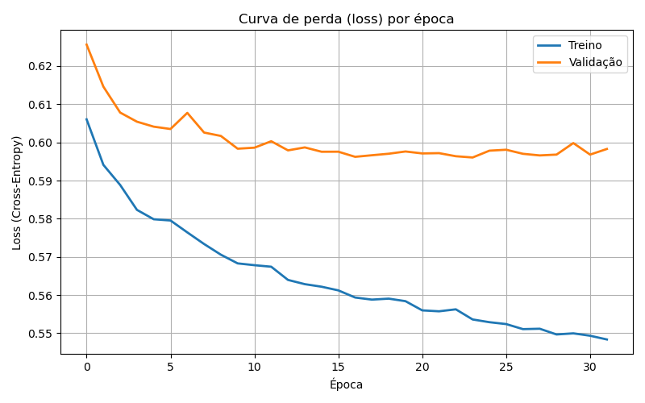
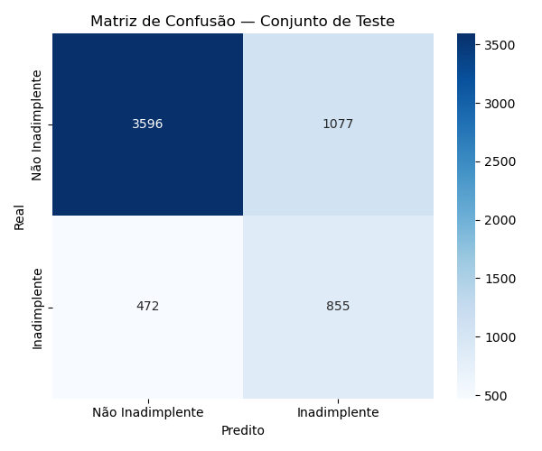

# Projeto 1 - Classification - Tomas Miele e Yuri Tabacof

## 1. Dataset Selection

**Nome do dataset:** Default of Credit Card Clients (Taiwan)  
**Fonte:** UCI Machine Learning Repository  
**URL:** https://archive.ics.uci.edu/ml/datasets/default+of+credit+card+clients  
**Tamanho:** 30.000 registros, 23 variáveis preditoras + 1 variável-alvo  

**Tarefa:** Classificação binária — prever se um cliente entrará em *default* (inadimplência) no mês seguinte.

**Justificativa da escolha:**
- O problema é **realista e relevante** no contexto financeiro (risco de crédito).  
- Contém **dados mistos** (numéricos e categóricos), o que torna o pré-processamento e o aprendizado mais desafiadores e instrutivos.  
- Possui **volume adequado** (>1.000 amostras e >5 atributos), atendendo aos requisitos do projeto.  
- Apresenta **classes desbalanceadas**, o que permite discutir métricas alternativas à acurácia e estratégias de balanceamento.  
- É uma base **pública e amplamente utilizada em pesquisa aplicada**, sem ser uma das clássicas proibidas (Titanic, Iris, Wine etc.).

## 2. Dataset Explanation

### Contexto e Descrição
O dataset contém informações de 30.000 clientes de cartão de crédito em Taiwan.  
Cada registro representa um cliente, e a variável-alvo indica se ele **deu default no mês seguinte** (`default.payment.next.month` = 1) ou não (= 0).  
Os atributos incluem dados **demográficos**, **financeiros** e **históricos de pagamento**.

### Variáveis

**Demográficas**
- `SEX`: Gênero (1 = masculino, 2 = feminino)  
- `EDUCATION`: Grau de instrução (1 = pós-graduação, 2 = graduação, 3 = ensino médio, 4/0/5/6 = outros)  
- `MARRIAGE`: Estado civil (1 = casado, 2 = solteiro, 3/0 = outros)  
- `AGE`: Idade (anos)

**Financeiras**
- `LIMIT_BAL`: Limite total de crédito (em NT$)

**Histórico de pagamento (últimos 6 meses)**
- `PAY_0`, `PAY_2`, `PAY_3`, `PAY_4`, `PAY_5`, `PAY_6` — Status de pagamento (valores inteiros, onde −2/−1/0 indicam pagos em dia, e 1, 2, ... indicam atraso em meses)

**Faturas mensais**
- `BILL_AMT1` a `BILL_AMT6` — Valores das faturas nos seis meses anteriores

**Pagamentos mensais**
- `PAY_AMT1` a `PAY_AMT6` — Valores pagos nos seis meses anteriores

**Alvo**
- `default.payment.next.month`: 0 = não entrou em default; 1 = entrou em default

### Tipos de dados
- **Numéricos contínuos:** `LIMIT_BAL`, `AGE`, `BILL_AMT*`, `PAY_AMT*`  
- **Numéricos discretos:** `PAY_*`  
- **Categóricos:** `SEX`, `EDUCATION`, `MARRIAGE`  
- **Binário (target):** `default.payment.next.month`

### Principais Desafios
- **Desbalanceamento:** apenas ~22% dos clientes estão em default.  
- **Categorias inválidas:** `EDUCATION` e `MARRIAGE` contêm códigos inconsistentes.  
- **Outliers:** valores muito altos em `BILL_AMT*` e `PAY_AMT*`.  
- **Multicolinearidade:** alta correlação entre séries temporais (meses consecutivos).  
- **Escalas muito diferentes:** necessidade de normalização antes do treino do MLP.

### Estatísticas e Visualizações (planejadas)
- Distribuição do alvo (`default.payment.next.month`)  
- Histogramas de `LIMIT_BAL` e `AGE`  
- Heatmap de correlação entre variáveis numéricas  
- Tabela resumo de médias, desvios e amplitudes  

### Considerações Éticas
Alguns atributos (gênero, estado civil, escolaridade) podem introduzir **viés algorítmico**.  
Discussões sobre *fairness* e mitigação de viés são pertinentes ao interpretar os resultados.

## 3. Data Cleaning and Normalization

### Estrutura e Natureza dos Dados

Os dados utilizados neste projeto representam informações de clientes de cartão de crédito, com atributos que descrevem aspectos **demográficos, financeiros e comportamentais**.  
Cada linha do dataset corresponde a um cliente, e cada coluna representa uma **feature** (atributo), como limite de crédito, idade, estado civil ou histórico de pagamento.  
Essa estrutura, em forma de **matriz de atributos**, é a base para a aplicação de técnicas de aprendizado supervisionado,  
em que cada exemplo possui um conjunto de entradas (features) e uma saída (rótulo).

As variáveis do conjunto de dados podem ser classificadas em dois tipos principais:

- **Numéricas:** representam valores contínuos ou discretos, como `LIMIT_BAL` (limite de crédito) e `AGE` (idade);  
- **Categóricas:** representam valores qualitativos, como `SEX`, `EDUCATION` e `MARRIAGE`.

Essa distinção é fundamental, pois **cada tipo de dado requer um tratamento específico** para que o modelo de aprendizado consiga interpretar corretamente as informações.

---

### Limpeza e Qualidade dos Dados

A qualidade dos dados é essencial para o desempenho de qualquer modelo de aprendizado de máquina.  
Durante a etapa de limpeza, foram verificados problemas comuns como **valores ausentes, duplicatas e inconsistências**.

- **Valores ausentes:** não foram encontrados no conjunto de dados.  
- **Duplicatas:** nenhuma linha duplicada foi identificada.  
- **Inconsistências:** categorias incorretas, como `EDUCATION = 0, 5, 6` e `MARRIAGE = 0`, foram recategorizadas como “Outros”, garantindo consistência nos dados.  
- **Valores inválidos:** apenas uma amostra foi removida por conter um valor incorreto na variável alvo (`default_payment_next_month`).

Após a limpeza, o dataset permaneceu com **30.000 amostras válidas**, todas completas e sem inconsistências estruturais.

---

### Pré-processamento e Transformação dos Dados

Como o modelo de aprendizado requer **entradas numéricas**, as variáveis categóricas foram **convertidas em formato numérico** por meio da técnica de **One-Hot Encoding**,  
criando uma coluna para cada categoria possível de `SEX`, `EDUCATION` e `MARRIAGE`.  
Esse processo garante que o modelo interprete corretamente diferenças qualitativas entre categorias, sem atribuir ordens artificiais a elas.

Em seguida, os dados numéricos foram **normalizados** para uma escala comum,  
de forma que todas as variáveis contribuam igualmente durante o treinamento da rede neural.  
Esse procedimento é essencial para evitar que atributos com valores mais altos dominem a função de custo do modelo.

Por fim, o conjunto de dados foi dividido em três subconjuntos:  
- **Treino (60%)** – usado para o aprendizado do modelo;  
- **Validação (20%)** – usado para ajuste de parâmetros;  
- **Teste (20%)** – usado para avaliar a capacidade de generalização.

A divisão foi feita de forma **estratificada**, mantendo a proporção original das classes (`default = 1` e `non-default = 0`) em todos os conjuntos.

---

### Resumo do Processo de Preparação

| Etapa | Ação Realizada |
|-------|----------------|
| Verificação de valores ausentes | Nenhum valor ausente encontrado |
| Remoção de duplicatas | Nenhuma duplicata detectada |
| Correção de categorias inválidas | Reclassificação de valores fora do intervalo válido |
| Exclusão de valores incorretos | 1 registro removido |
| Codificação de variáveis categóricas | One-Hot Encoding aplicado |
| Normalização | Escalonamento dos atributos numéricos |
| Divisão do dataset | 60% treino, 20% validação, 20% teste (estratificado) |

Esses procedimentos asseguraram que o dataset estivesse **limpo, consistente e devidamente estruturado**,  
seguindo as boas práticas de **qualidade, balanceamento e padronização de dados** recomendadas em Machine Learning.

## 4. Implementação do MLP (NumPy)

### Implementação
Implementamos um **MLP do zero**, usando apenas **NumPy** (produto matricial, ativações, softmax, cross‑entropy, backprop e atualização dos pesos). O objetivo é classificar **inadimplência** (`default_payment_next_month`) a partir dos dados já limpos/normalizados.

### Arquitetura e treino
```
Entrada (d_in) → ReLU(64) → ReLU(32) → Softmax(2)
```
- **Ativações:** ReLU nas camadas escondidas; Softmax na saída.  
- **Loss:** Cross-Entropy (com **pesos de classe** para desbalanceamento) + L2.  
- **Otimização:** **SGD mini-batch** com **momentum**, *learning rate decay* e **early stopping**.  
- **Limiar de decisão:** escolhido na validação para **máximo F1**.

### Hiperparâmetros
- Camadas escondidas: **(64, 32)**  
- Batch size: **256**  
- Épocas máx.: **60** (com *early stopping*, paciência=8)  
- Learning rate inicial: **1e‑2** (decai 0.9 a cada 5 épocas)  
- L2 (weight decay): **1e‑4**  
- Seed: **42**  
- Threshold (val, melhor F1): **0.47**

### Resultados
| Conjunto   | Acc   | Precision | Recall | F1    | ROC‑AUC |
|------------|:-----:|:---------:|:------:|:-----:|:-------:|
| **Treino** | 0.7533 | 0.4603   | 0.6660 | 0.5443 | 0.7979 |
| **Validação** | 0.7367 | 0.4325   | 0.6104 | **0.5062** | 0.7567 |
| **Teste**  | **0.7418** | **0.4425** | **0.6443** | **0.5247** | **0.7750** |

- **Acc (Accuracy):**
Proporção total de acertos — ou seja, quantos exemplos o modelo classificou corretamente (positivos e negativos) entre todos os exemplos. Fórmula: (VP + VN) / Total
- **Precision:** Proporção de exemplos classificados como positivos que realmente são positivos. Mede a confiabilidade das previsões positivas. Fórmula: VP / (VP + FP)
- **Recall (Sensibilidade):** Proporção de exemplos positivos reais que o modelo conseguiu capturar. Mede a capacidade de detectar inadimplentes. Fórmula: VP / (VP + FN)
- **F1-score:** Média harmônica entre Precision e Recall. Equilibra os dois em uma única métrica, especialmente útil com classes desbalanceadas. Fórmula: 2 · (Prec · Rec) / (Prec + Rec)
- **ROC‑AUC:** Área sob a curva ROC (Receiver Operating Characteristic), que mede a capacidade do modelo de separar classes. Quanto mais próximo de 1, melhor a separação entre inadimplentes e não inadimplentes.


**Observação.** Em dados desbalanceados, otimizar **F1/Recall** (via threshold) pode reduzir a **accuracy** em relação ao baseline que sempre prevê a classe majoritária. Aqui priorizamos recuperar mais inadimplentes mantendo AUC e F1 sólidos.

### Código Completo

``` pyodide install="pandas, numpy, matplotlib, scikit-learn, seaborn"

# projeto1.py
# Data Cleaning & Normalization + MLP from scratch (NumPy)
# ✔️ Rode com "Run Python File" (▶) no VS Code, sem passar argumentos.
# ✔️ Passos:
#     1) Auto-descobre o Excel (.xls/.xlsx), limpa e normaliza (One-Hot, split, z-score)
#     2) Treina um MLP (NumPy) com ReLU + Softmax, CE ponderada, mini-batch SGD + Momentum, L2, early stopping
#     3) Ajusta threshold pelo melhor F1 na validação e imprime métricas
#
# Requisitos:
#   pip install numpy pandas scikit-learn xlrd
#
# Saídas (padrão: ./processed):
#   - X_train.npy, y_train.npy, X_val.npy, y_val.npy, X_test.npy, y_test.npy
#   - scaler_mu.npy, scaler_sd.npy, columns.json
#   - class_dist_before.json, class_dist_splits.json
#   - cleaned_full_sample.csv (amostra 5%)
#   - training_curves.csv (perdas por época)
#   - final_metrics.json (métricas + threshold escolhido)
#
# ------------------------------------------------------------------------------
#                                IMPORTS
# ------------------------------------------------------------------------------

import json
from pathlib import Path
import numpy as np
import pandas as pd
from sklearn.model_selection import train_test_split


# ------------------------------------------------------------------------------
#                                CONFIG
# ------------------------------------------------------------------------------

# (A) Cleaning
SEED = 42
WINSOR_LO = 1.0
WINSOR_HI = 99.0
SAMPLE_CSV_FRAC = 0.05
OUTDIR_NAME = "processed"

POSSIBLE_DATAFILES = [
    "default of credit card clients.xls",
    "default_of_credit_card_clients.xls",
    "default of credit card clients.xlsx",
    "default_of_credit_card_clients.xlsx",
    "UCI_Credit_Card.xls",
    "UCI_Credit_Card.xlsx",
]

TARGET_CANDIDATES = [
    "default_payment_next_month",
    "default.payment.next.month",
    "default payment next month",
    "y",
]
ID_CANDIDATES = ["id", "unnamed:_0"]
CAT_COLS_RAW = ["sex", "education", "marriage"]

# (B) MLP Hyperparameters
MLP_LAYERS = (64, 32)     # camadas escondidas
MLP_L2 = 1e-4             # weight decay
LR_INIT = 1e-2            # learning rate inicial
BATCH_SIZE = 256
EPOCHS = 60
PATIENCE = 8              # early stopping (épocas sem melhora em val)
LR_DECAY = 0.9            # multiplicador a cada LR_DECAY_EVERY épocas
LR_DECAY_EVERY = 5
MOMENTUM = 0.9            # SGD momentum

# ------------------------------------------------------------------------------
#                             HELPER FUNCTIONS
# ------------------------------------------------------------------------------

def print_header(title):
    print("\n" + "=" * 80)
    print(title)
    print("=" * 80)


def normalize_columns(cols):
    out = []
    for c in cols:
        c2 = str(c).strip()
        c2 = c2.replace("\n", " ").replace("\r", " ").replace("-", " ").replace("/", " ")
        c2 = " ".join(c2.split())
        c2 = c2.lower().replace(" ", "_")
        out.append(c2)
    return out


def try_read_excel(path: Path) -> pd.DataFrame:
    for kw in [
        dict(header=0, engine="xlrd"),
        dict(header=1, engine="xlrd"),
        dict(header=0),
        dict(header=1),
    ]:
        try:
            return pd.read_excel(path, sheet_name=0, **kw)
        except Exception:
            continue
    return pd.read_excel(path)


def find_first_present(candidates, cols):
    for c in candidates:
        if c in cols:
            return c
    return None


def auto_find_datafile(script_dir: Path) -> Path:
    for name in POSSIBLE_DATAFILES:
        p = script_dir / name
        if p.exists():
            return p
    for p in sorted(script_dir.glob("*.xls")) + sorted(script_dir.glob("*.xlsx")):
        return p
    raise FileNotFoundError(
        "❌ Nenhum arquivo .xls/.xlsx encontrado. Coloque o Excel na mesma pasta do .py."
    )


# ------------------------------------------------------------------------------
#                       SECTION 3 — CLEANING & NORMALIZATION
# ------------------------------------------------------------------------------

def run_cleaning_and_save(script_dir: Path):
    outdir = script_dir / OUTDIR_NAME
    outdir.mkdir(parents=True, exist_ok=True)

    # 1) Carregar .xls/.xlsx automaticamente
    print_header("[1] Carregando planilha de dados (auto-descoberta)")
    data_path = auto_find_datafile(script_dir)
    print(f"Arquivo detectado: {data_path.name}")
    df = try_read_excel(data_path)
    print(f"Shape bruto lido: {df.shape}")

    df.columns = normalize_columns(df.columns)
    print("Colunas normalizadas (primeiras 15):", list(df.columns)[:15])

    df = df.dropna(how="all")
    print(f"Shape após remover linhas 100% vazias: {df.shape}")

    # Detectar schema X1..X23 + Y e renomear
    cols = set(df.columns)
    x_schema_ok = {
        "x1","x2","x3","x4","x5","x6","x7","x8","x9","x10","x11",
        "x12","x13","x14","x15","x16","x17","x18","x19","x20","x21","x22","x23","y"
    }.issubset(cols)

    if x_schema_ok:
        mapping = {
            "unnamed:_0": "id",
            "x1":  "limit_bal",
            "x2":  "sex",
            "x3":  "education",
            "x4":  "marriage",
            "x5":  "age",
            "x6":  "pay_0",
            "x7":  "pay_2",
            "x8":  "pay_3",
            "x9":  "pay_4",
            "x10": "pay_5",
            "x11": "pay_6",
            "x12": "bill_amt1",
            "x13": "bill_amt2",
            "x14": "bill_amt3",
            "x15": "bill_amt4",
            "x16": "bill_amt5",
            "x17": "bill_amt6",
            "x18": "pay_amt1",
            "x19": "pay_amt2",
            "x20": "pay_amt3",
            "x21": "pay_amt4",
            "x22": "pay_amt5",
            "x23": "pay_amt6",
            "y":   "default_payment_next_month",
        }
        df = df.rename(columns={k: v for k, v in mapping.items() if k in df.columns})
        if "id" not in df.columns:
            if "unnamed:_0" in df.columns:
                df = df.rename(columns={"unnamed:_0": "id"})
            else:
                df.insert(0, "id", np.arange(len(df)))
        print("[PATCH] Detectado schema X1..X23 + Y. Colunas renomeadas para nomes oficiais.")
        print("Colunas (amostra):", list(df.columns)[:15])

    # detectar alvo e id
    target_col = find_first_present(TARGET_CANDIDATES, df.columns)
    if target_col is None:
        raise KeyError(f"Coluna alvo não encontrada. Esperado uma entre: {TARGET_CANDIDATES}.")
    id_col = find_first_present(ID_CANDIDATES, df.columns)
    print(f"Alvo: {target_col} | ID: {id_col if id_col else '(não há — usarei índice)'}")

    # coerção de tipos (alvo e categóricas)
    df[target_col] = pd.to_numeric(df[target_col], errors="coerce")
    n_nan_target = int(df[target_col].isna().sum())
    if n_nan_target > 0:
        print(f"[PATCH] Removendo {n_nan_target} linhas com alvo inválido.")
        df = df.dropna(subset=[target_col])
    df[target_col] = df[target_col].astype(int)
    for c in ["sex", "education", "marriage"]:
        if c in df.columns:
            df[c] = pd.to_numeric(df[c], errors="coerce").fillna(0).astype(int)

    # 2) Duplicados
    print_header("[2] Remoção de duplicados")
    n_before = len(df)
    df = df.drop_duplicates()
    print(f"Duplicados removidos: {n_before - len(df)} | shape atual: {df.shape}")

    # 3) Missing antes
    print_header("[3] Missing values (antes)")
    miss_before = df.isna().sum()
    print(miss_before[miss_before > 0] if miss_before.sum() > 0 else "Sem valores ausentes.")

    # 4) Normalizar categorias inválidas
    print_header("[4] Normalizando categorias inválidas (education, marriage)")
    if "education" in df.columns:
        df["education"] = df["education"].replace({0: 4, 5: 4, 6: 4})
    if "marriage" in df.columns:
        df["marriage"] = df["marriage"].replace({0: 3})

    # 5) Categóricas vs. numéricas
    print_header("[5] Identificando colunas categóricas e numéricas")
    all_cols = df.columns.tolist()
    cat_cols = [c for c in CAT_COLS_RAW if c in df.columns]
    num_cols = [c for c in all_cols if c not in cat_cols + [target_col] + ([id_col] if id_col else [])]
    print(f"Categóricas: {cat_cols}")
    print(f"Numéricas (exemplos): {num_cols[:10]} ... (total {len(num_cols)})")

    # 6) Distribuição do alvo
    print_header("[6] Distribuição do alvo (antes do split)")
    class_dist = df[target_col].value_counts().sort_index().to_dict()
    print(f"Distribuição de classes: {class_dist}")
    with open(outdir / "class_dist_before.json", "w") as f:
        json.dump({int(k): int(v) for k, v in class_dist.items()}, f, indent=2)

    # 7) One-Hot
    print_header("[7] One-Hot Encoding")
    X_cat = pd.get_dummies(df[cat_cols].astype("category"), drop_first=False) if cat_cols else pd.DataFrame(index=df.index)
    X_num = df[num_cols].copy()

    print("Percentis numéricos (ANTES do winsorize) [p1, p50, p99]:")
    for c in num_cols:
        p1, p50, p99 = np.percentile(X_num[c], [1, 50, 99])
        print(f"  {c:>18s}: p1={p1:.2f}, p50={p50:.2f}, p99={p99:.2f}")

    print_header(f"[8] Winsorize/clip numéricas (p={WINSOR_LO:.1f}–{WINSOR_HI:.1f})")
    for c in num_cols:
        lo, hi = np.percentile(X_num[c], [WINSOR_LO, WINSOR_HI])
        X_num[c] = X_num[c].clip(lo, hi)
    print("Percentis numéricos (DEPOIS do winsorize) [p1, p50, p99]:")
    for c in num_cols:
        p1, p50, p99 = np.percentile(X_num[c], [1, 50, 99])
        print(f"  {c:>18s}: p1={p1:.2f}, p50={p50:.2f}, p99={p99:.2f}")

    X = pd.concat([X_num, X_cat], axis=1)
    y = df[target_col].to_numpy().astype(int)

    print_header("[10] Missing values (depois do encoding/winsorize)")
    miss_after = X.isna().sum()
    if miss_after.sum() > 0:
        print(miss_after[miss_after > 0].sort_values(ascending=False))
        for c in X.columns:
            if X[c].isna().any():
                med = X[c].median() if X[c].dtype.kind in "if" else 0
                X[c] = X[c].fillna(med)
        print("Após imputação:", int(X.isna().sum().sum()), "missing restantes (esperado: 0).")
    else:
        print("Sem valores ausentes após transformações.")

    # 11) Split 60/20/20
    print_header("[11] Split estratificado 60/20/20 (train/val/test)")
    X_np = X.to_numpy(dtype=np.float32)
    X_train, X_tmp, y_train, y_tmp = train_test_split(
        X_np, y, test_size=0.4, random_state=SEED, stratify=y
    )
    X_val, X_test, y_val, y_test = train_test_split(
        X_tmp, y_tmp, test_size=0.5, random_state=SEED, stratify=y_tmp
    )
    dist_splits = {
        "train": {int(k): int(v) for k, v in pd.Series(y_train).value_counts().sort_index().to_dict().items()},
        "val":   {int(k): int(v) for k, v in pd.Series(y_val).value_counts().sort_index().to_dict().items()},
        "test":  {int(k): int(v) for k, v in pd.Series(y_test).value_counts().sort_index().to_dict().items()},
    }
    print("Distribuição por split:", json.dumps(dist_splits, indent=2))
    with open(outdir / "class_dist_splits.json", "w") as f:
        json.dump(dist_splits, f, indent=2)

    # 12) Z-score
    print_header("[12] Z-score (fit no treino, aplicar em val/test)")
    mu = X_train.mean(axis=0, keepdims=True)
    sd = X_train.std(axis=0, keepdims=True) + 1e-8
    X_train_z = (X_train - mu) / sd
    X_val_z   = (X_val   - mu) / sd
    X_test_z  = (X_test  - mu) / sd
    print(f"Média média (train, pós z-score) ≈ {X_train_z.mean():.4f} | Desvio médio ≈ {X_train_z.std():.4f}")

    # 13) Salvar artefatos
    print_header("[13] Salvando artefatos e datasets")
    np.save(outdir / "X_train.npy", X_train_z)
    np.save(outdir / "y_train.npy", y_train)
    np.save(outdir / "X_val.npy", X_val_z)
    np.save(outdir / "y_val.npy", y_val)
    np.save(outdir / "X_test.npy", X_test_z)
    np.save(outdir / "y_test.npy", y_test)
    np.save(outdir / "scaler_mu.npy", mu.astype(np.float32))
    np.save(outdir / "scaler_sd.npy", sd.astype(np.float32))
    columns = X.columns.tolist()
    with open(outdir / "columns.json", "w") as f:
        json.dump({"columns": columns}, f, indent=2)

    if SAMPLE_CSV_FRAC > 0:
        print(f"Salvando amostra limpa ({SAMPLE_CSV_FRAC*100:.1f}%)…")
        X_all_z = np.vstack([X_train_z, X_val_z, X_test_z])
        y_all   = np.concatenate([y_train, y_val, y_test])
        df_clean = pd.DataFrame(X_all_z, columns=columns)
        df_clean["target"] = y_all
        df_clean.sample(frac=SAMPLE_CSV_FRAC, random_state=SEED).to_csv(
            outdir / "cleaned_full_sample.csv", index=False
        )

    print("\n✅ Cleaning concluído. Artefatos salvos em:", outdir.resolve())


# ------------------------------------------------------------------------------
#                     SECTION 4 — MLP IMPLEMENTATION (NumPy)
# ------------------------------------------------------------------------------

# -------- utils de métricas e batches --------
def one_hot(y, n_classes):
    oh = np.zeros((y.shape[0], n_classes), dtype=np.float32)
    oh[np.arange(y.shape[0]), y] = 1.0
    return oh

def accuracy(y_true, y_pred):
    return float((y_true == y_pred).mean())

def precision_recall_f1(y_true, y_pred, positive=1):
    tp = np.sum((y_true == positive) & (y_pred == positive))
    fp = np.sum((y_true != positive) & (y_pred == positive))
    fn = np.sum((y_true == positive) & (y_pred != positive))
    prec = tp / (tp + fp + 1e-12)
    rec  = tp / (tp + fn + 1e-12)
    f1   = 2*prec*rec/(prec+rec+1e-12)
    return float(prec), float(rec), float(f1)

def roc_auc_score_binary(y_true, scores):
    pos = scores[y_true == 1]
    neg = scores[y_true == 0]
    if len(pos) == 0 or len(neg) == 0:
        return float("nan")
    concat = np.concatenate([pos, neg])
    order = np.argsort(concat, kind="mergesort")
    ranks = np.empty_like(order, dtype=np.float64)
    ranks[order] = np.arange(1, len(concat) + 1)  # 1..N
    r_pos = ranks[:len(pos)]
    auc = (r_pos.sum() - len(pos)*(len(pos)+1)/2) / (len(pos)*len(neg) + 1e-12)
    return float(auc)

def iterate_minibatches(X, Y, batch, rng):
    idx = rng.permutation(len(X))
    for i in range(0, len(X), batch):
        ib = idx[i:i+batch]
        yield X[ib], Y[ib]


# -------- classe MLP --------
class MLP:
    def __init__(self, d_in, layers=(64,), d_out=2, seed=42, l2=1e-4, momentum=0.9):
        rng = np.random.default_rng(seed)
        self.l2 = l2
        self.class_weights = None  # definido externamente, se desejado
        self.momentum = momentum
        dims = [d_in] + list(layers) + [d_out]
        self.params = {}
        self.v = {}  # velocidades para momentum

        # Inicialização He (ReLU): N(0, sqrt(2/fan_in))
        for i in range(len(dims)-1):
            fan_in = dims[i]
            W = rng.normal(0, np.sqrt(2.0/fan_in), size=(dims[i], dims[i+1])).astype(np.float32)
            b = np.zeros((1, dims[i+1]), dtype=np.float32)
            self.params[f"W{i+1}"] = W
            self.params[f"b{i+1}"] = b
            self.v[f"W{i+1}"] = np.zeros_like(W)
            self.v[f"b{i+1}"] = np.zeros_like(b)

    def set_class_weights(self, cw):
        self.class_weights = np.asarray(cw, dtype=np.float32)

    def init_output_bias_with_prior(self, p_pos):
        """Define b0=0 e b1=logit(p) para saída binária."""
        p = float(np.clip(p_pos, 1e-6, 1-1e-6))
        logit = np.log(p / (1.0 - p)).astype(np.float32)
        L = len(self.params)//2
        b = self.params[f"b{L}"].copy()
        if b.shape[1] == 2:
            b[:, 0] = 0.0
            b[:, 1] = logit
            self.params[f"b{L}"] = b

    @staticmethod
    def relu(x):
        return np.maximum(0, x)

    @staticmethod
    def relu_grad(x):
        return (x > 0).astype(np.float32)

    @staticmethod
    def softmax(z):
        z = z - z.max(axis=1, keepdims=True)
        e = np.exp(z, dtype=np.float32)
        return e / (e.sum(axis=1, keepdims=True) + 1e-12)

    def forward(self, X):
        cache = {"A0": X}
        A = X
        L = len(self.params)//2
        for i in range(1, L):
            Z = A @ self.params[f"W{i}"] + self.params[f"b{i}"]
            A = self.relu(Z)
            cache[f"Z{i}"] = Z; cache[f"A{i}"] = A
        ZL = A @ self.params[f"W{L}"] + self.params[f"b{L}"]
        P = self.softmax(ZL)
        cache[f"Z{L}"] = ZL; cache[f"A{L}"] = P
        return P, cache

    def loss(self, P, Y_onehot):
        # Cross-Entropy ponderada por classe + L2
        if self.class_weights is None:
            cw = np.ones(Y_onehot.shape[1], dtype=np.float32)
        else:
            cw = self.class_weights
        w_i = (Y_onehot * cw).sum(axis=1)  # peso por amostra
        sum_w = float(w_i.sum() + 1e-12)
        ce_per_sample = -np.sum(Y_onehot * np.log(P + 1e-12), axis=1)
        ce = float(np.sum(w_i * ce_per_sample) / sum_w)

        l2_term = 0.0
        L = len(self.params)//2
        for i in range(1, L+1):
            l2_term += np.sum(self.params[f"W{i}"]**2)
        return ce + self.l2 * 0.5 * l2_term

    def backward(self, cache, Y_onehot):
        grads = {}
        if self.class_weights is None:
            cw = np.ones(Y_onehot.shape[1], dtype=np.float32)
        else:
            cw = self.class_weights
        w_i = (Y_onehot * cw).sum(axis=1)[:, None]  # (N,1)
        sum_w = float(w_i.sum() + 1e-12)

        L = len(self.params)//2
        A_L = cache[f"A{L}"]  # probs

        # dZ (softmax + CE) ponderado
        dZ = ((A_L - Y_onehot) * w_i) / sum_w
        A_prev = cache[f"A{L-1}"] if L > 1 else cache["A0"]
        grads[f"W{L}"] = A_prev.T @ dZ + self.l2 * self.params[f"W{L}"]
        grads[f"b{L}"] = np.sum(dZ, axis=0, keepdims=True)
        dA_prev = dZ @ self.params[f"W{L}"].T

        # camadas escondidas (ReLU)
        for i in range(L-1, 0, -1):
            Z = cache[f"Z{i}"]; A_prev = cache[f"A{i-1}"] if i > 1 else cache["A0"]
            dZ = dA_prev * self.relu_grad(Z)
            grads[f"W{i}"] = A_prev.T @ dZ + self.l2 * self.params[f"W{i}"]
            grads[f"b{i}"] = np.sum(dZ, axis=0, keepdims=True)
            dA_prev = dZ @ self.params[f"W{i}"].T
        return grads

    def step_sgd(self, grads, lr):
        """SGD com momentum clássico."""
        L = len(self.params)//2
        for i in range(1, L+1):
            self.v[f"W{i}"] = self.momentum * self.v[f"W{i}"] + grads[f"W{i}"]
            self.v[f"b{i}"] = self.momentum * self.v[f"b{i}"] + grads[f"b{i}"]
            self.params[f"W{i}"] -= lr * self.v[f"W{i}"]
            self.params[f"b{i}"] -= lr * self.v[f"b{i}"]

    def predict_proba(self, X):
        P, _ = self.forward(X)
        return P

    def predict(self, X, threshold=None):
        P, _ = self.forward(X)
        if threshold is None:
            return np.argmax(P, axis=1), P[:, 1]
        else:
            ppos = P[:, 1]
            yhat = (ppos >= threshold).astype(int)
            return yhat, ppos


def train_mlp_numpy(outdir: Path):
    print_header("🔧 [4] MLP Implementation (NumPy) — Treino/Val/Test")

    # carregar dados processados
    X_train = np.load(outdir / "X_train.npy")
    y_train = np.load(outdir / "y_train.npy")
    X_val   = np.load(outdir / "X_val.npy")
    y_val   = np.load(outdir / "y_val.npy")
    X_test  = np.load(outdir / "X_test.npy")
    y_test  = np.load(outdir / "y_test.npy")

    n_classes = int(np.max([y_train.max(), y_val.max(), y_test.max()]) + 1)
    Y_train = one_hot(y_train, n_classes)
    Y_val   = one_hot(y_val, n_classes)

    # class weights "balanced": N / (K * n_c)
    counts = np.bincount(y_train, minlength=n_classes).astype(np.float32)
    cw_balanced = (len(y_train) / (n_classes * counts + 1e-12)).astype(np.float32)

    mlp = MLP(
        d_in=X_train.shape[1],
        layers=MLP_LAYERS,
        d_out=n_classes,
        seed=SEED,
        l2=MLP_L2,
        momentum=MOMENTUM
    )
    mlp.set_class_weights(cw_balanced)

    # inicializa viés de saída com a prevalência da classe positiva (para binário)
    p_pos_train = float((y_train == 1).mean())
    mlp.init_output_bias_with_prior(p_pos_train)

    rng = np.random.default_rng(SEED)
    lr = LR_INIT
    best_vl = np.inf
    wait = 0
    hist = {"loss_tr": [], "loss_vl": []}
    best_params = {k: v.copy() for k, v in mlp.params.items()}

    for ep in range(1, EPOCHS+1):
        # ===== treino (mini-batch SGD cobrindo TODO o dataset) =====
        for xb, yb in iterate_minibatches(X_train, Y_train, BATCH_SIZE, rng):
            P, cache = mlp.forward(xb)
            loss = mlp.loss(P, yb)
            grads = mlp.backward(cache, yb)
            mlp.step_sgd(grads, lr)

        # logging perdas em fim de época
        P_tr = mlp.predict_proba(X_train); loss_tr = mlp.loss(P_tr, Y_train)
        P_vl = mlp.predict_proba(X_val);   loss_vl = mlp.loss(P_vl, Y_val)
        hist["loss_tr"].append(loss_tr); hist["loss_vl"].append(loss_vl)
        print(f"Epoch {ep:02d} | loss_tr={loss_tr:.4f}  loss_vl={loss_vl:.4f}  lr={lr:.4f}")

        # early stopping
        if loss_vl < best_vl - 1e-4:
            best_vl = loss_vl; wait = 0
            best_params = {k: v.copy() for k, v in mlp.params.items()}
        else:
            wait += 1
            if wait >= PATIENCE:
                print("Early stopping acionado.")
                break

        # lr decay
        if (ep % LR_DECAY_EVERY) == 0:
            lr *= LR_DECAY

    # restaurar melhores pesos
    mlp.params = best_params

    # ---- escolher threshold pelo melhor F1 na validação ----
    _, ppos_val = mlp.predict(X_val, threshold=None)
    best_t, best_f1 = 0.5, -1.0
    for t in np.linspace(0.05, 0.95, 91):
        yhat_t = (ppos_val >= t).astype(int)
        _, _, f1_t = precision_recall_f1(y_val, yhat_t, positive=1)
        if f1_t > best_f1:
            best_f1 = f1_t
            best_t = float(t)
    print(f"\nThreshold escolhido na validação (melhor F1): t* = {best_t:.2f} (F1={best_f1:.4f})")
    print(f"Proporção prevista como positiva em val @t*: {(ppos_val >= best_t).mean():.3f}")

    # avaliação
    def report(split, X, y, threshold):
        y_pred, ppos = mlp.predict(X, threshold=threshold)
        acc = accuracy(y, y_pred)
        prec, rec, f1 = precision_recall_f1(y, y_pred, positive=1)
        auc = roc_auc_score_binary(y, ppos)
        print(f"[{split}] acc={acc:.4f}  prec={prec:.4f}  rec={rec:.4f}  f1={f1:.4f}  auc={auc:.4f}")
        return {"acc": acc, "prec": prec, "rec": rec, "f1": f1, "auc": auc, "pos_rate": float((y_pred==1).mean())}

    print()
    mtr_tr = report("train", X_train, y_train, threshold=best_t)
    mtr_vl = report("val",   X_val,   y_val,   threshold=best_t)
    mtr_te = report("test",  X_test,  y_test,  threshold=best_t)

    # salvar curvas
    pd.DataFrame(hist).to_csv(outdir / "training_curves.csv", index=False)
    # salvar métricas finais + threshold
    final_metrics = {
        "train": mtr_tr, "val": mtr_vl, "test": mtr_te,
        "layers": list(MLP_LAYERS), "l2": MLP_L2, "lr_init": LR_INIT,
        "batch_size": BATCH_SIZE, "epochs": EPOCHS, "patience": PATIENCE,
        "class_weights": cw_balanced.tolist(),
        "threshold_val_f1": best_t,
        "momentum": MOMENTUM
    }
    with open(outdir / "final_metrics.json", "w") as f:
        json.dump(final_metrics, f, indent=2)

    print("\n✅ Treinamento concluído. Métricas salvas em:", outdir / "final_metrics.json")
    print("Curvas de treino salvas em:", outdir / "training_curves.csv")


# ------------------------------------------------------------------------------
#                                      MAIN
# ------------------------------------------------------------------------------

def main():
    script_dir = Path(__file__).parent
    outdir = script_dir / OUTDIR_NAME

    # Se ainda não existir X_train.npy, roda o cleaning
    need_clean = not (outdir / "X_train.npy").exists()
    if need_clean:
        run_cleaning_and_save(script_dir)
    else:
        print_header("🔁 Artefatos de cleaning encontrados — pulando etapa de limpeza.")

    # Treinar MLP (NumPy)
    train_mlp_numpy(outdir)


if __name__ == "__main__":
    main()


```

## 5. Curvas de Erro e Visualizações

A curva de perda (**loss**) foi monitorada durante o treinamento do MLP, tanto no conjunto de **treino** quanto de **validação**, ao longo das épocas. Isso permite avaliar o comportamento do modelo em relação a **convergência**, **overfitting** e **early stopping**.



Como mostrado no gráfico acima:

- O **loss de treino** decresce consistentemente até estabilizar.
- O **loss de validação** também decresce nas primeiras épocas, mas apresenta uma estabilização e flutuação posterior.
- O modelo utilizou **early stopping com paciência de 8 épocas**, interrompendo o treinamento antes de overfitting.
- A partir da época ~20, não houve mais ganhos relevantes na validação, indicando que o modelo já havia convergido.

Esse padrão é típico em dados com certo desbalanceamento: o modelo consegue otimizar a perda, mas o ganho em recall e F1 tende a saturar cedo.

### Código para gerar a curva de perda:

``` pyodide install="pandas, matplotlib, os"

import os
import pandas as pd
import matplotlib.pyplot as plt

# Garantir que o diretório de saída existe
os.makedirs("assets", exist_ok=True)

# Carregar o CSV com as curvas
df = pd.read_csv("processed/training_curves.csv")

# Plotar curvas de perda
plt.figure(figsize=(8, 5))
plt.plot(df["loss_tr"], label="Treino", linewidth=2)
plt.plot(df["loss_vl"], label="Validação", linewidth=2)
plt.xlabel("Época")
plt.ylabel("Loss (Cross-Entropy)")
plt.title("Curva de perda (loss) por época")
plt.legend()
plt.grid(True)
plt.tight_layout()

# Salvar imagem
plt.savefig("assets/loss_curve.png")
plt.show()

```

## 6. Métricas de Avaliação e Matriz de Confusão

Além das métricas quantitativas (acurácia, precisão, recall, F1-score e AUC), a **matriz de confusão** oferece uma visão clara dos tipos de erro que o modelo comete ao classificar clientes no conjunto de **teste**.



### Código para gerar a matriz de confusão:

``` pyodide install="numpy, matplotlib, seaborn, sklearn"

import numpy as np
import json
from pathlib import Path
from projeto1 import MLP, one_hot  # importa sua classe e função

# Paths
outdir = Path("processed")
X_test = np.load(outdir / "X_test.npy")
y_test = np.load(outdir / "y_test.npy")
X_train = np.load(outdir / "X_train.npy")
y_train = np.load(outdir / "y_train.npy")
X_val = np.load(outdir / "X_val.npy")
y_val = np.load(outdir / "y_val.npy")

# Hiperparâmetros (você pode pegar isso do final_metrics.json também)
with open(outdir / "final_metrics.json") as f:
    final_metrics = json.load(f)

layers = tuple(final_metrics["layers"])
l2 = final_metrics["l2"]
momentum = final_metrics["momentum"]
threshold = final_metrics["threshold_val_f1"]
batch_size = final_metrics["batch_size"]
epochs = final_metrics["epochs"]
lr_init = final_metrics["lr_init"]
patience = final_metrics["patience"]
class_weights = np.array(final_metrics["class_weights"], dtype=np.float32)

# One-hot
Y_train = one_hot(y_train, 2)
Y_val = one_hot(y_val, 2)

# Treinar novamente o MLP com os mesmos dados (replicando treino para recuperar pesos)
mlp = MLP(
    d_in=X_train.shape[1],
    layers=layers,
    d_out=2,
    seed=42,
    l2=l2,
    momentum=momentum
)
mlp.set_class_weights(class_weights)
mlp.init_output_bias_with_prior(float((y_train == 1).mean()))

# Repetir treino
rng = np.random.default_rng(42)
best_params = {k: v.copy() for k, v in mlp.params.items()}
best_vl = float("inf")
wait = 0
lr = lr_init

def iterate_minibatches(X, Y, batch, rng):
    idx = rng.permutation(len(X))
    for i in range(0, len(X), batch):
        ib = idx[i:i+batch]
        yield X[ib], Y[ib]

for ep in range(1, epochs+1):
    for xb, yb in iterate_minibatches(X_train, Y_train, batch_size, rng):
        P, cache = mlp.forward(xb)
        loss = mlp.loss(P, yb)
        grads = mlp.backward(cache, yb)
        mlp.step_sgd(grads, lr)
    # Validação
    P_vl, _ = mlp.forward(X_val)
    loss_vl = mlp.loss(P_vl, Y_val)
    if loss_vl < best_vl - 1e-4:
        best_vl = loss_vl
        wait = 0
        best_params = {k: v.copy() for k, v in mlp.params.items()}
    else:
        wait += 1
        if wait >= patience:
            break
    if ep % 5 == 0:
        lr *= 0.9

# Restaurar melhores pesos
mlp.params = best_params

# Predição no teste com threshold ótimo
yhat_test, _ = mlp.predict(X_test, threshold=threshold)
np.save(outdir / "final_yhat_test.npy", yhat_test)
print("✅ Predições salvas em processed/final_yhat_test.npy")

import numpy as np
import seaborn as sns
from sklearn.metrics import confusion_matrix
import matplotlib.pyplot as plt

# Carregar dados
y_test = np.load("processed/y_test.npy")
y_pred = np.load("processed/final_yhat_test.npy")  # ou gere a predição no seu script final

# Confusion matrix
cm = confusion_matrix(y_test, y_pred)
labels = ["Não Inadimplente", "Inadimplente"]

# Plot
plt.figure(figsize=(6, 5))
sns.heatmap(cm, annot=True, fmt='d', cmap='Blues', xticklabels=labels, yticklabels=labels)
plt.xlabel("Predito")
plt.ylabel("Real")
plt.title("Matriz de Confusão — Conjunto de Teste")
plt.tight_layout()
plt.savefig("assets/confusion_matrix.png")  # ajuste o caminho conforme o GitHub Pages
plt.show()

```

### Interpretação:

- **3596 clientes** foram corretamente identificados como **não inadimplentes** (*verdadeiros negativos*).
- **855 clientes inadimplentes** foram corretamente identificados (*verdadeiros positivos*).
- **472 inadimplentes** foram classificados como não inadimplentes (*falsos negativos*), o que representa um risco de crédito não detectado.
- **1077 não inadimplentes** foram classificados incorretamente como inadimplentes (*falsos positivos*), o que pode levar à recusa de crédito injusta.

### Conclusão:

O modelo apresenta um bom desempenho em **recuperar inadimplentes**, com **855 acertos**, mas ainda comete **472 erros críticos (falsos negativos)** — o que pode impactar negativamente instituições financeiras que dependem dessa previsão para concessão de crédito.

A calibragem via **threshold ótimo na validação** priorizou o **F1-score e recall da classe minoritária**, aceitando sacrificar parte da precisão para detectar mais inadimplentes. Essa escolha foi intencional, considerando que o custo de um falso negativo (inadimplente não detectado) é normalmente maior que o de um falso positivo.

**Nota:** Os dados são desbalanceados (~22% inadimplentes), e por isso o modelo foi treinado com **pesos de classe ajustados**, **regularização L2**, e **early stopping**, além da **normalização por z-score**.

## Uso de I.A.

Utilizamos o auxílio do chatGPT para:
- Fazer README do projeto.
- Gerar funções auxiliares em python.
- Revisar e melhorar trechos de código.