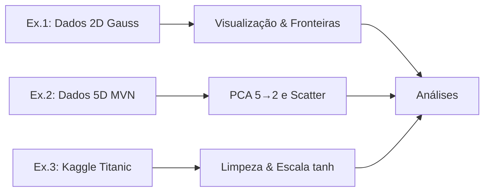
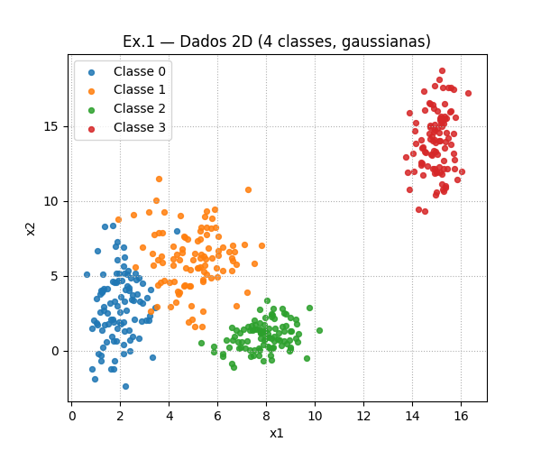
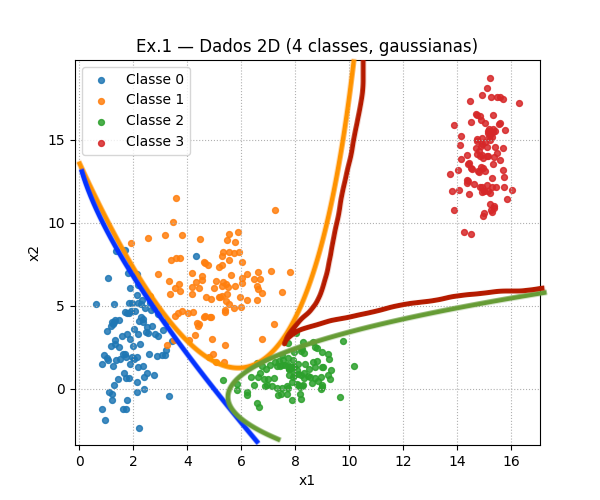
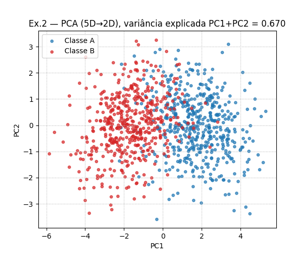
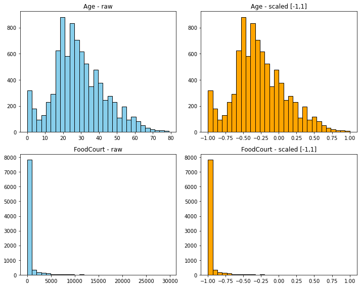

# Roteiro - Data

Este relatório contém: geração dos dados (Ex.1 e Ex.2), visualizações e pré-processamento do Spaceship Titanic (Ex.3), com análise explicativa.


## Visão geral do pipeline




## Exercício 1

Geração e plotagem dos dados (o output do md exec não funciona com plt.show, então o gráfico da saída é mostrado abaixo do código como imagem):   

obs: ajuda de IA

``` pyodide install="numpy, matplotlib"
import numpy as np
import matplotlib.pyplot as plt

rng = np.random.default_rng(42)

# Parâmetros fornecidos
means = {
    0: np.array([2.0, 3.0]),
    1: np.array([5.0, 6.0]),
    2: np.array([8.0, 1.0]),
    3: np.array([15.0, 14.0]),
}
stds = {
    0: np.array([0.8, 2.5]),
    1: np.array([1.2, 1.9]),
    2: np.array([0.9, 0.9]),
    3: np.array([0.5, 2.0]),
}

X_list, y_list = [], []
for k in range(4):
    mu = means[k]
    sd = stds[k]
    cov = np.diag(sd**2)
    Xi = rng.multivariate_normal(mu, cov, size=100)
    yi = np.full(100, k)
    X_list.append(Xi)
    y_list.append(yi)

X = np.vstack(X_list)
y = np.concatenate(y_list)

# Scatter por classe
fig, ax = plt.subplots(figsize=(6,5))
for k, color in zip(range(4), ["tab:blue","tab:orange","tab:green","tab:red"]):
    ax.scatter(X[y==k,0], X[y==k,1], s=18, alpha=0.85, label=f"Classe {k}", c=color)

ax.set_title("Ex.1 — Dados 2D (4 classes, gaussianas)")
ax.set_xlabel("x1")
ax.set_ylabel("x2")
ax.legend(loc="best", frameon=True)
ax.grid(True, ls=":")
plt.show()

```



### Analyze and Draw Boundaries:

- Examine the scatter plot carefully. Describe the distribution and overlap of the four classes.

Red is isolated in the top right, green is isolated in the bottom right (but close to blue and orange clusters), blue is mostly on the left side with some spread, and orange is in the middle overlapping a little bit with blue.

- Based on your visual inspection, could a simple, linear boundary separate all classes?

No, because it is impossible to separate class 0 and 1 using a line. This means that a linear model would not be able to classify these points correctly.

- On your plot, sketch the decision boundaries that you think a trained neural network might learn to separate these classes.

It should probably look something like this:



## Exercício 2

Generating the Data

``` pyodide install="numpy, matplotlib"

import numpy as np
import matplotlib.pyplot as plt

rng = np.random.default_rng(123)

miA = np.zeros(5)
SomA = np.array([
    [1,   0.8, 0.1, 0,   0  ],
    [0.8, 1,   0.3, 0,   0  ],
    [0.1, 0.3, 1,   0.5, 0  ],
    [0,   0,   0.5, 1,   0.2],
    [0,   0,   0,   0.2, 1  ],
], dtype=float)

miB = np.full(5, 1.5)
SomB = np.array([
    [1.5, -0.7, 0.2, 0,   0  ],
    [-0.7, 1.5, 0.4, 0,   0  ],
    [0.2,  0.4, 1.5, 0.6, 0  ],
    [0,    0,   0.6, 1.5, 0.3],
    [0,    0,   0,   0.3, 1.5],
], dtype=float)

def nearest_psd(M, eps=1e-8):
    # Corrige PSD numericamente (clipe de autovalores)
    w, v = np.linalg.eigh(M)
    w = np.clip(w, eps, None)
    return (v * w) @ v.T

SomA = nearest_psd(SomA)
SomB = nearest_psd(SomB)

XA = rng.multivariate_normal(miA, SomA, size=500)
XB = rng.multivariate_normal(miB, SomB, size=500)

X5 = np.vstack([XA, XB])
y5 = np.array([0]*500 + [1]*500)

# PCA via SVD
Xc = X5 - X5.mean(axis=0, keepdims=True)
U, S, Vt = np.linalg.svd(Xc, full_matrices=False)
# Componentes principais nas colunas de V (linhas de Vt)
W = Vt[:2].T            # 5x2
X2 = Xc @ W             # projeção 2D

# variância explicada
explained = (S**2) / (len(X5)-1)
ratio = explained / explained.sum()
var_ratio = ratio[:2]

fig, ax = plt.subplots(figsize=(6,5))
ax.scatter(X2[y5==0,0], X2[y5==0,1], s=14, alpha=0.7, label="Classe A", c="tab:blue")
ax.scatter(X2[y5==1,0], X2[y5==1,1], s=14, alpha=0.7, label="Classe B", c="tab:red")
ax.set_title(f"Ex.2 — PCA (5D→2D), variância explicada PC1+PC2 = {var_ratio.sum():.3f}")
ax.set_xlabel("PC1"); ax.set_ylabel("PC2")
ax.legend(frameon=True); ax.grid(True, ls=":")
plt.show()

```



### Analyzing the Plots:

- Based on your 2D projection, describe the relationship between the two classes.

The two classes are heavily overlapping in the 2D projection, therefore it would be impossible to separate them with high accuracy using only two dimension.

- Discuss the linear separability of the data. Explain why this type of data structure poses a challenge for simple linear models and would likely require a multi-layer neural network with non-linear activation functions to be classified accurately.

The data is not linearly separable in the 2D projection, as there is significant overlap between the two classes. This means that no straight line can be drawn to separate all points of one class from the other. Simple linear models, such as logistic regression or linear SVMs, rely on finding a linear decision boundary to classify data points. Therefore, a multi-layer neural network with non-linear activation functions is necessary to capture the complex relationships and patterns in the data, allowing for more flexible decision boundaries that can better separate the classes.


## Exercício 3

### Describing the Data:

Briefly describe the dataset's objective (i.e., what does the Transported column represent?).

O objetivo é prever a coluna Transported, que indica se o passageiro foi transportado para outra dimensão (True ou False).

List the features and identify which are numerical (e.g., Age, RoomService) and which are categorical (e.g., HomePlanet, Destination).

Features numéricas:

- Age, RoomService, FoodCourt, ShoppingMall, Spa, VRDeck.

Features categóricas:

- HomePlanet, CryoSleep, Cabin (deck/num/side), Destination, VIP, Name.

Identificadores:

- PassengerId (não usado como feature preditiva).


Investigate the dataset for missing values. Which columns have them, and how many?

Rodando o código abaixo (não irá funcionar aqui com o markdown exec, mas funciona no Python localmente):

``` pyodide install="pandas"
import pandas as pd

# carregar dados
import pandas as pd
url = "https://yuritaba.github.io/personal_page/roteiro1/spaceship-titanic/train.csv"
df = pd.read_csv(url)
na_counts = df.isna().sum().sort_values(ascending=False)
na_counts.head(15)
```

Output:

```
CryoSleep       217
ShoppingMall    208
VIP             203
HomePlanet      201
Name            200
Cabin           199
VRDeck          188
FoodCourt       183
Spa             183
Destination     182
RoomService     181
Age             179
PassengerId       0
Transported       0
dtype: int64
```

Logo, as colunas com valores ausentes são todas exceto PassengerId e Transported.

Preprocess the Data: Your goal is to clean and transform the data so it can be fed into a neural network. The tanh activation function produces outputs in the range [-1, 1], so your input data should be scaled appropriately for stable training.

- Encode Categorical Features: Convert categorical columns like HomePlanet, CryoSleep, and Destination into a numerical format. One-hot encoding is a good choice.

- Normalize/Standardize Numerical Features: Scale the numerical columns (e.g., Age, RoomService, etc.). Since the tanh activation function is centered at zero and outputs values in [-1, 1], Standardization (to mean 0, std 1) or Normalization to a [-1, 1] range are excellent choices. Implement one and explain why it is a good practice for training neural networks with this activation function.

Primeiramente fazemos um one-hot encoding das colunas categóricas, depois lidamos com os valores ausentes (imputação), e também normalizamos as colunas numéricas para o intervalo [-1, 1].

(Novamente, o código abaixo não irá funcionar aqui com o markdown exec, mas funciona no Python localmente):

obs: ajuda de IA

``` pyodide install="pandas, numpy, matplotlib"

# separar target
y = df["Transported"].astype(int)
X = df.drop(columns=["Transported","PassengerId","Name"])

# separar colunas categóricas e numéricas
num_cols = ["Age","RoomService","FoodCourt","ShoppingMall","Spa","VRDeck"]
cat_cols = ["HomePlanet","CryoSleep","Cabin","Destination","VIP"]

# one-hot encoding manual
X_cat = []
for col in cat_cols:
    uniques = sorted(X[col].dropna().unique())
    mapping = {val:i for i,val in enumerate(uniques)}
    arr = np.zeros((len(X), len(uniques)))
    for i, val in enumerate(X[col]):
        if pd.isna(val):
            continue
        arr[i, mapping[val]] = 1
    X_cat.append(arr)
X_cat = np.concatenate(X_cat, axis=1) if X_cat else np.empty((len(X),0))

# imputar valores numéricos (mediana)
for col in num_cols:
    median = X[col].median()
    X[col] = X[col].fillna(median)

# normalizar numéricas para [-1,1]
X_num = X[num_cols].values.astype(float)
mins = X_num.min(axis=0)
maxs = X_num.max(axis=0)
X_num_scaled = 2 * (X_num - mins) / (maxs - mins) - 1

# juntar numéricas e categóricas
X_proc = np.concatenate([X_num_scaled, X_cat], axis=1)

df.head()
```

- Numéricas → preenchidas com a mediana de cada coluna.

A mediana é robusta contra outliers, evitando distorções no escalonamento para [-1,1].

- Categóricas → no one-hot, valores nulos não viraram nenhuma categoria ativa (linha de zeros).

Isso equivale a tratar o missing como uma “categoria ausente” sem inventar valores, mantendo consistência no vetor de entrada.

Visualize the Results:

Create histograms for one or two numerical features (like FoodCourt or Age) before and after scaling to show the effect of your transformation.



Como esperado, a "proporção" continua a mesma, mas agora os valores estão entre -1 e 1, adequados para a tanh.