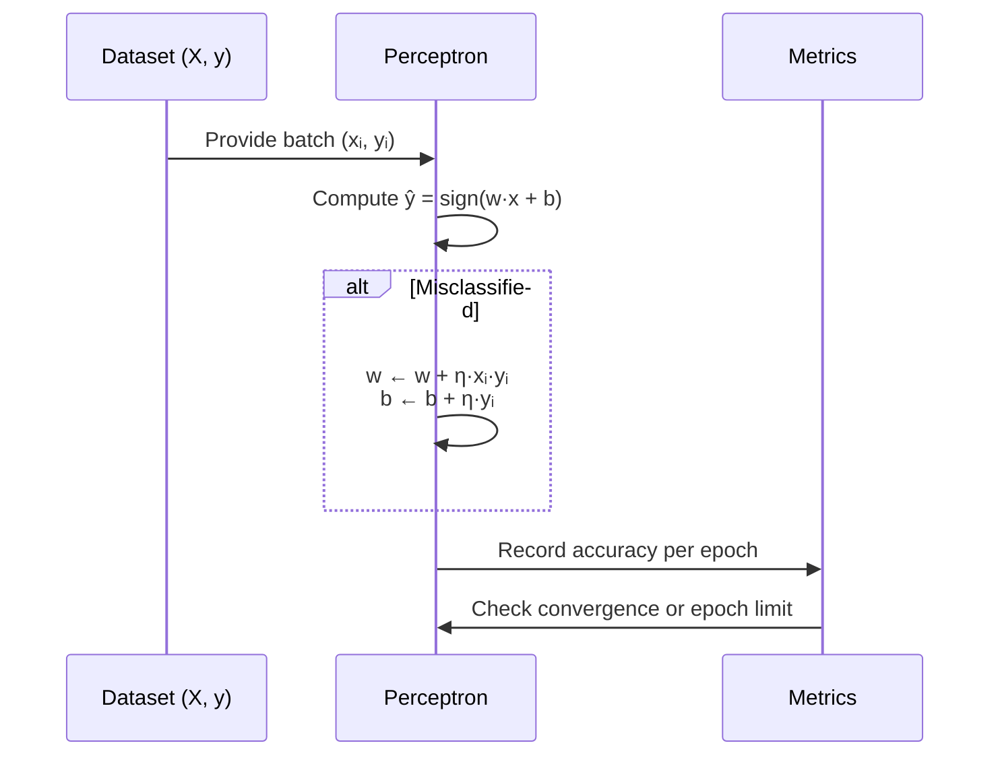
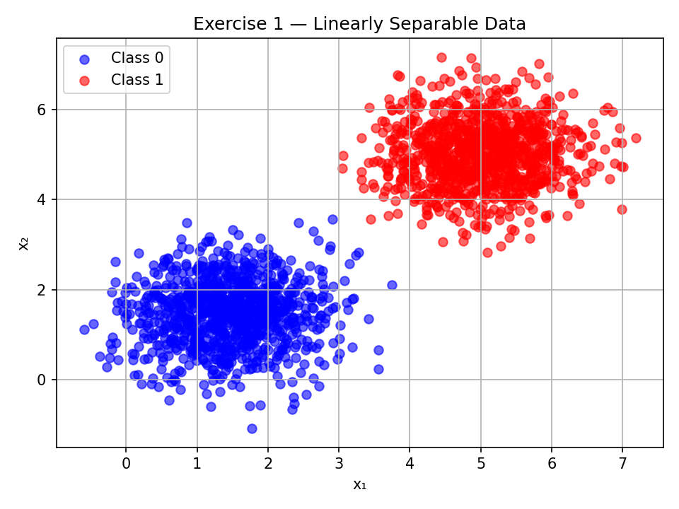
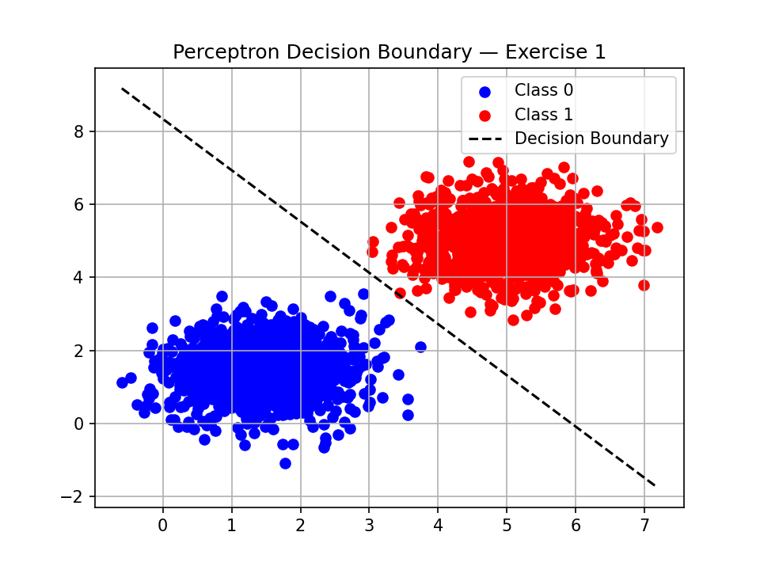
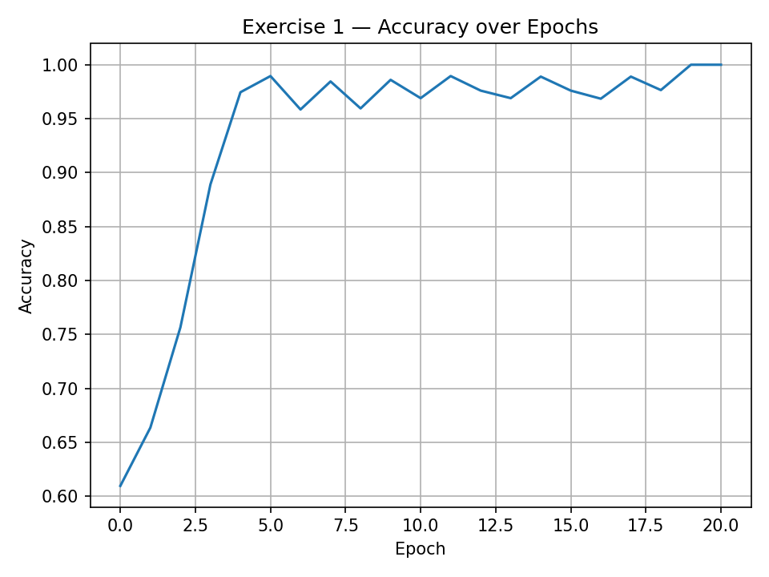
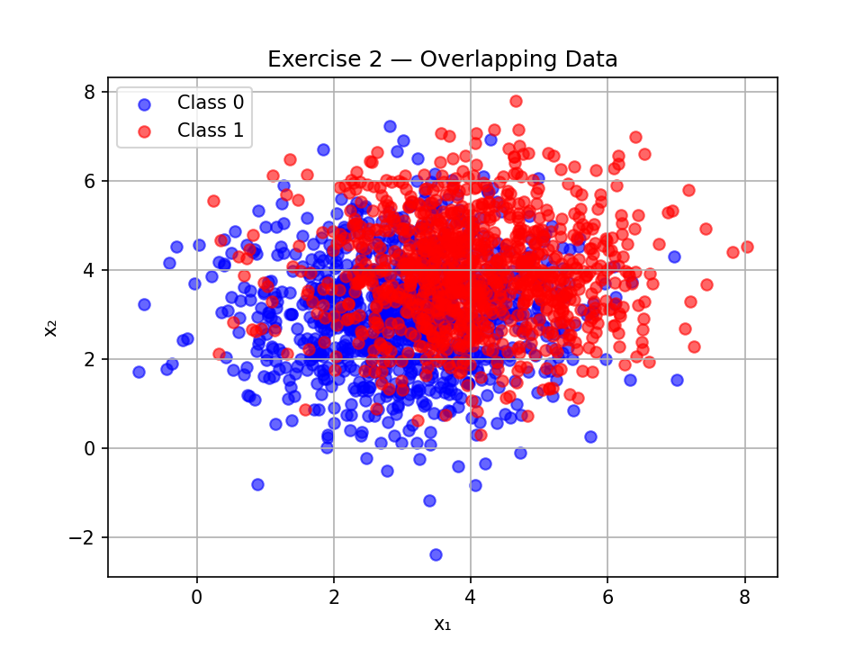
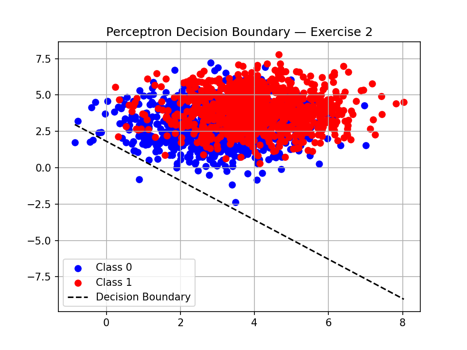
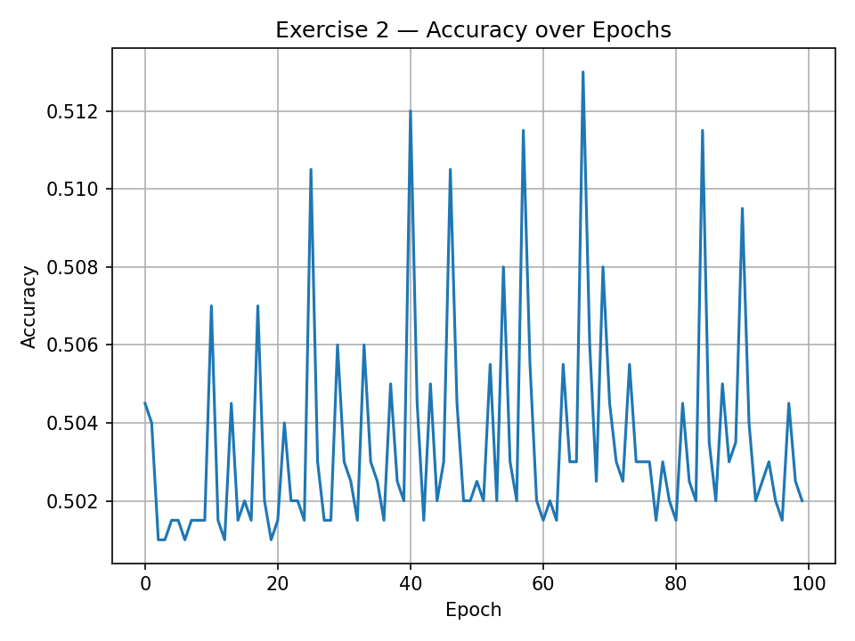

# Project — Perceptrons  
**Author:** Yuri Tabacof  
**Date:** 2025-09-14
**Course:** Machine Learning Fundamentals  
**Language:** Python (NumPy-only Implementation)

---

## Overview

This activity explores **Perceptrons and their limitations** by implementing, from scratch, a single-layer perceptron capable of classifying 2D data.  
Two experiments are conducted:

1. **Exercise 1:** Linearly separable data → fast convergence expected.  
2. **Exercise 2:** Overlapping data → convergence issues and limited accuracy.

The report includes data generation, perceptron implementation, visualization of decision boundaries, and comparative analysis between the two experiments.

---

## 1. Pipeline Overview


---

## 2. Implementation Approach

### 2.1 Key Design Principles
- No machine learning libraries: only NumPy for basic vector/matrix operations.
- Fully manual forward pass and update rule:
( w = w + \eta \cdot y \cdot x ), ( b = b + \eta \cdot y ).
- Activation function: sign function (returns +1 or −1).
- Stopping criteria: convergence (no weight update) or 100 epochs.
- Tracking: accuracy computed after each epoch.

### 2.2 Learning Workflow


---

## 3. Exercise 1 — Linearly Separable Data

### 3.1 Data Generation

```pyodide install="numpy, matplotlib"
import numpy as np
import matplotlib.pyplot as plt

rng = np.random.default_rng(42)

# Parameters
mu0, mu1 = [1.5, 1.5], [5, 5]
cov = [[0.5, 0], [0, 0.5]]

X0 = rng.multivariate_normal(mu0, cov, size=1000)
X1 = rng.multivariate_normal(mu1, cov, size=1000)

X = np.vstack((X0, X1))
y = np.hstack((np.ones(1000)*-1, np.ones(1000)))  # -1 and +1 labels

# Visualization
plt.scatter(X0[:,0], X0[:,1], c='blue', alpha=0.6, label='Class 0')
plt.scatter(X1[:,0], X1[:,1], c='red', alpha=0.6, label='Class 1')
plt.title("Exercise 1 — Linearly Separable Data")
plt.xlabel("x₁"); plt.ylabel("x₂")
plt.legend(); plt.grid(True)
plt.tight_layout()
plt.savefig("ex1_data.png", dpi=150)
plt.close()
```



### 3.2 Perceptron Implementation

```pyodide install="numpy, matplotlib"
class Perceptron:
    def __init__(self, lr=0.01, max_epochs=100, seed=42):
        self.lr = lr
        self.max_epochs = max_epochs
        self.rng = np.random.default_rng(seed)
        
    def fit(self, X, y):
        n_samples, n_features = X.shape
        self.w = self.rng.standard_normal(n_features)
        self.b = 0.0
        
        self.accuracy_ = []
        for epoch in range(self.max_epochs):
            errors = 0
            for xi, target in zip(X, y):
                update = target * (np.dot(self.w, xi) + self.b)
                if update <= 0:  # Misclassified
                    self.w += self.lr * target * xi
                    self.b += self.lr * target
                    errors += 1
            y_pred = self.predict(X)
            acc = np.mean(y_pred == y)
            self.accuracy_.append(acc)
            if errors == 0:
                break
        return self
    
    def predict(self, X):
        linear_output = X @ self.w + self.b
        return np.where(linear_output >= 0, 1, -1)

````


### 3.3 Training results

```pyodide install="numpy, matplotlib"

perceptron = Perceptron(lr=0.01, max_epochs=100)
perceptron.fit(X, y)

# Decision boundary
x1_range = np.linspace(X[:,0].min(), X[:,0].max(), 100)
x2_boundary = -(perceptron.w[0]*x1_range + perceptron.b) / perceptron.w[1]

plt.scatter(X[y==-1,0], X[y==-1,1], color='blue', label='Class 0')
plt.scatter(X[y==1,0], X[y==1,1], color='red', label='Class 1')
plt.plot(x1_range, x2_boundary, 'k--', label='Decision Boundary')
plt.legend(); plt.grid(True)
plt.title("Perceptron Decision Boundary — Exercise 1")
plt.savefig("ex1_boundary.png", dpi=150)
plt.close()

````



### 3.4 Accuracy over Epochs

```pyodide install="numpy, matplotlib"
plt.plot(perceptron.accuracy_)
plt.title("Exercise 1 — Accuracy over Epochs")
plt.xlabel("Epoch")
plt.ylabel("Accuracy")
plt.grid(True)
plt.tight_layout()
plt.savefig("ex1_accuracy.png", dpi=150)
plt.close()
```



## 4. Exercise 2 — Overlapping Data

### 4.1 Data Generation

```pyodide install="numpy, matplotlib"
mu0, mu1 = [3, 3], [4, 4]
cov = [[1.5, 0], [0, 1.5]]

X0 = rng.multivariate_normal(mu0, cov, size=1000)
X1 = rng.multivariate_normal(mu1, cov, size=1000)

X = np.vstack((X0, X1))
y = np.hstack((np.ones(1000)*-1, np.ones(1000)))

plt.scatter(X0[:,0], X0[:,1], c='blue', alpha=0.6, label='Class 0')
plt.scatter(X1[:,0], X1[:,1], c='red', alpha=0.6, label='Class 1')
plt.title("Exercise 2 — Overlapping Data")
plt.xlabel("x₁"); plt.ylabel("x₂")
plt.legend(); plt.grid(True)
plt.savefig("ex2_data.png", dpi=150)
plt.close()
```


### 4.2 Training results (using the same perceptron)

```pyodide install="numpy, matplotlib"
p2 = Perceptron(lr=0.01, max_epochs=100)
p2.fit(X, y)

x1_range = np.linspace(X[:,0].min(), X[:,0].max(), 100)
x2_boundary = -(p2.w[0]*x1_range + p2.b) / p2.w[1]

plt.scatter(X[y==-1,0], X[y==-1,1], color='blue', label='Class 0')
plt.scatter(X[y==1,0], X[y==1,1], color='red', label='Class 1')
plt.plot(x1_range, x2_boundary, 'k--', label='Decision Boundary')
plt.legend(); plt.grid(True)
plt.title("Perceptron Decision Boundary — Exercise 2")
plt.savefig("ex2_boundary.png", dpi=150)
plt.close()
```



### 4.3 Accuracy over Epochs

```pyodide install="numpy, matplotlib"
plt.plot(p2.accuracy_)
plt.title("Exercise 2 — Accuracy over Epochs")
plt.xlabel("Epoch")
plt.ylabel("Accuracy")
plt.grid(True)
plt.tight_layout()
plt.savefig("ex2_accuracy.png", dpi=150)
plt.close()
```



## 5. Comparative Analysis

| Aspect                     | Exercise 1 (Linearly Separable) | Exercise 2 (Overlapping) |
|----------------------------|----------------------------------|--------------------------|
| Variance                   | Low (0.5)                        | High (1.5)               |
| Epochs to Convergence      | Fast (4)                         | Oscillates         |
| Decision Boundary Quality  | Clear separation                 | Poor separation          |    
| Final Accuracy             | ~100%                            | ~50%                     |
| Observations               | Perceptron works.               | Perceptron struggles.    |

## 6. Conclusion

- A perceptron is effective for linearly separable problems but fails for overlapping or non-linear ones.
- Data separability directly affects convergence rate and accuracy.
- This activity reinforces the motivation for multi-layer networks and non-linear activation functions in modern neural architectures.

## 7. AI usage

ChatGPT was used to help with the markdown creation, Copilot was used to help with some code snippets. All code was tested and modified as needed.